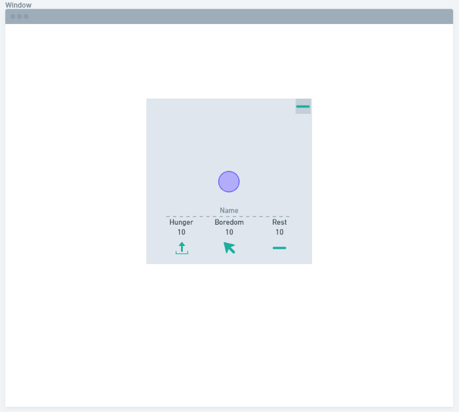
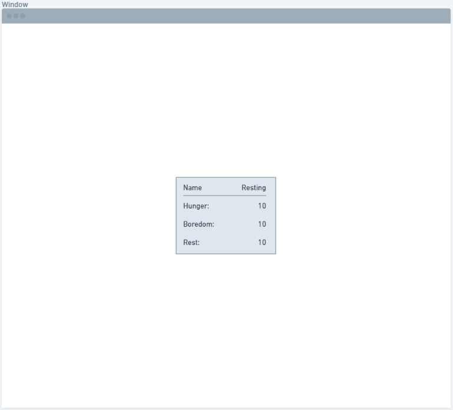

<h1>Care of Loading</h1>

<h2>Narrative</h2>

You were trying to load a game. Loading *became* the game.  

<h2>Technology Used</h2>

* HTML
* CSS
* Javascript
* JQuery

<h2>Wireframes</h2>

 


<h2>User Story - Completed</h2>

1. Click link to start game
2. Modal pops up with loading spinner
3. Care for the loading spinner, stats and buttons displayed beneath spinner.
   * Name the spinner
   * 'Feed' by 'uploading' data
   * Poke to prevent boredom
   * Minimize modal to rest
4. Loading spinner transforms into more 'sleek' versions over time.
5. The spinner will die and will reflect that death.


<h2>Stretch - Completed</h2>

1. Visual representation of diminished stats
   * Spinner turns red when 'hungry'
   * Spinner drifts side to side when bored
   * Spinner slows when tired
2. Dialogue when first opened to introduce the game objectives.

<h2>Development</h2>

Development was pretty steady for this project. 
Originally, I started in functional development for the M.V.P with the intent on making it object oriented afterwards. I kept the functional design as it wasn't neccesary to refactor with the goals I had outlined. 
<h3>Day 1 - Design notes</h3>

Initially, I came up with 3 possible pet ideas, and sketched out rough layouts for each.
The loading spinner 'monster' struck me as more interesting because the needs fulfilment would be more abstract than literal.

<h3>Day 2 - Completing Design notes, Beginning code</h3>

How does a loading spinner eat? - It crunches data\
How does a loading spinner play? - Click it with a mouse\
How does a loading spinner rest? - Minimize the game\
I worked up a wireframe on whimsical.com. Using 2 modals, one for primary interaction and pet display, and one for when the pet was resting.
I designed these modals to be minimal and flat, using shades of grey for everything and a highlight of teals for the pet name and interactable text and icons.
The only other thing with color would be the pet itself.
By end of day I had the HTML skeleton worked up and a few basic CSS properties for general alignment and to remove those pesky margins and paddings on everything.

<h3>Day 3 - JS Contruction</h3>
 
This went by fast, I broke my User Story down into basic nuggets and started writing them up.
JS and JQuery went down smooth and other than a typo or two no real snags.
Dropped in my CSS for the spinner. Constructed CSS for the layout.
All in all a productive day, a long day, but productive.

<h3>Day 4 - Warning: Road Closed Ahead</h3>

I finished the MVP early, and even knocked out the rest of the CSS.
It was time to tackle my icebox.
Visual representation of stats.
Making the spinner pet with CSS was the biggest help here, modifying its colors was pretty simple, slowing the spin as well.
But how do you move it, without stopping the spin?
This took me longer than I care to admit to realize I could just throw a div around the pet and move the div instead of the pet, maintaining all the animation for the pet concurrently.
The final item in the icebox waiting to be started.
Introduction to the game mechanics. This was, admittedly, one of the first ideas I had for the spinner concept. I could introduce the game, as if it were the loading of the "actual" game. I had about half the dialogue already worked out from Day 1's design notes.
I wrote up the outline of what I wanted. These lines in order, then this happens, etc.\
In order.\
Sure JS/JQuery would put them there in order, no one would ever see them.
Below I outline why it was a challenge and how I overcame it.

<h3>Day 5 - Cleanup and Polish</h3>

As the title suggests, in preparation for final product I dedicate time to small QoL tweaks and comment/code cleanup.

<h2>Challenges</h2>

The primary challenge I came across was sequencing the introduction dialogue and actions.
Javascript is asynchronous when it runs so even with a setTimeout, whatever came next was running before the timeout ran. It wasn't waiting for anything except to run what is in the timeout.
After reading up on the ways to delay running things I came up with a process of wrapping what I want to happen in a function call that delays what happens and cascading the sequence in a stack of that function call.
Sample:
```javscript
sleep(4000).then(() => { 
   First thing to happen
   // Runs First thing after 4 seconds.
   sleep(4000).then(() => { 
      Second thing to happen
      // Runs Second thing after 4 more seconds. Giving First thing 4 seconds to do its thing. (ie. display text)
      sleep(3500).then(() => { 
            Third thing to happen
            // Runs Third thing after 3.5 seconds. Giving Second thing 3.5 seconds to do its thing.
      });
   });
});
```